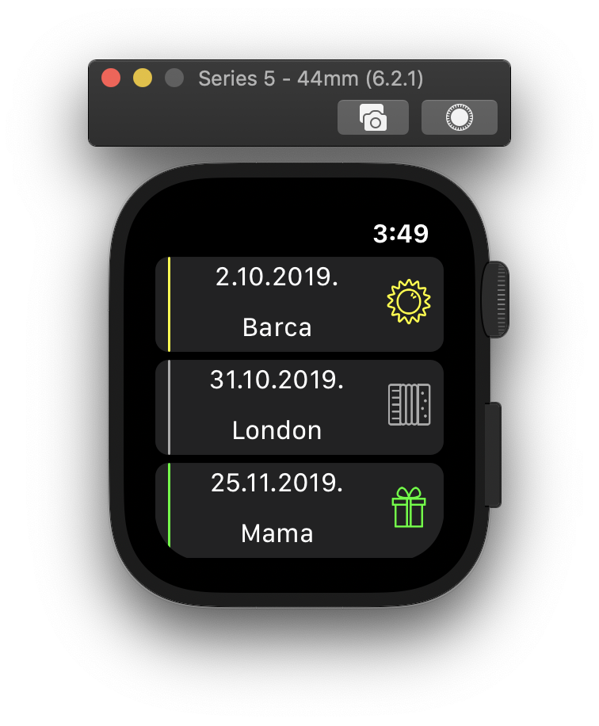
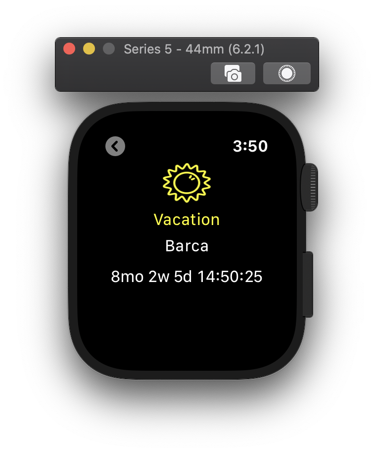

# Countdown App for WatchOS

  
   

  

  

  

- This project was based on the article ["Apple watchOS tutorial:
creating a countdown app"](https://www.bornfight.com/blog/apple-watchos-tutorial-creating-a-countdown-app/) of Bornfight.

- It is an application in which you can have all your important events and dates in one place and use the application as a reminder or a timer for each one.
